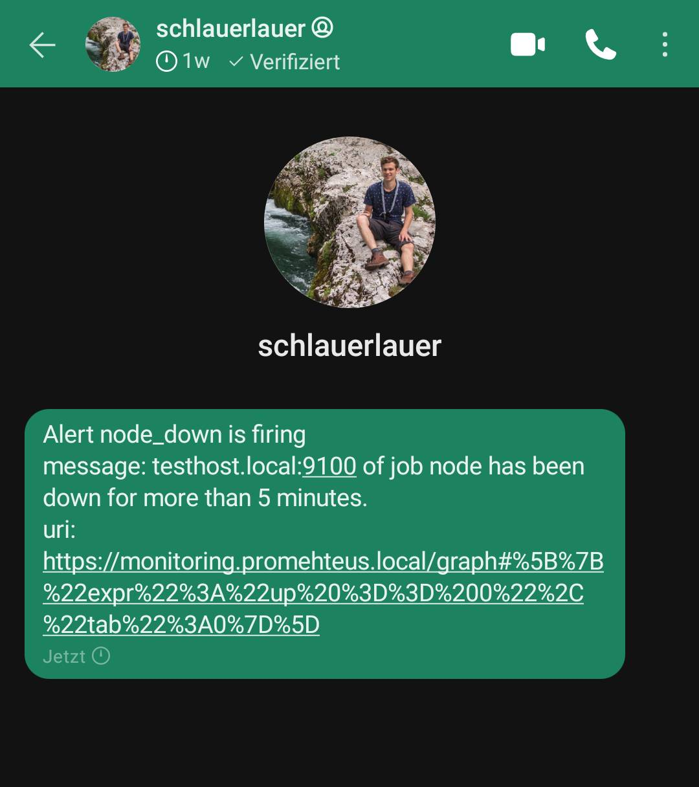

# Alertmanager Webhook Signal [](https://gitlab.com/schlauerlauer/alertmanager-webhook-signal/-/commits/main)

This project creates a little (dockerized) REST API Endpoint for an [Alertmanager webhook receiver](https://prometheus.io/docs/alerting/latest/configuration/#webhook_config)
and maps it to the [dockerized signal-cli](https://github.com/bbernhard/signal-cli-rest-api).

This is useful if you already have the [signal-cli from bbernhard](https://github.com/bbernhard/signal-cli-rest-api) running as a [Home-Assistant notifier](https://www.home-assistant.io/integrations/signal_messenger/) for example.



## Run container

```bash
docker run -d --rm --name alertmanager-signal \
  -p 10000:10000 \
  registry.gitlab.com/schlauerlauer/alertmanager-webhook-signal:latest
```

### Test webhook

```bash
curl -X POST localhost:10000/api/v1/alert -d '{
    "alerts": [
        {
            "status": "firing",
            "labels": {
                "alertname": "test"
            },
            "annotations": {
                "message": "Test alert."
            }
        }
    ]
}
'
```

## Configuration

A `config.yaml` file is needed for configuration.

Example configuration:

```yaml
server:
  port: 10000 # required
  timeout: 5s # required
signal:
  number: 23456 # required
  recipients: # required
  - 67890
  send: http://10.88.0.1:10001/v2/send # required
  ignoreLabels: # optional (default [])
  - alertname
  ignoreAnnotations: [] # optional (default [])
  generatorURL: true # optional (default false)
```

Entry | Example | Explanation | Required
-|-|-|-
server.port | 10000 | Port the script should listen on | yes
server.timeout | 5s | Webhook request timeout | yes
signal.number | "+4912345678901" | Phone number of signal cli sender | yes
signal.recipients | ["+4923456789012"] | Phone number(s) of the recipients | yes
signal.send | "http://10.88.0.1:10001/v2/send" | http endpoint of the [signal cli](https://github.com/bbernhard/signal-cli-rest-api) | yes
signal.ignoreLabels | ["alertname"] | Name of label(s) not to include in the signal message | no
signal.ignoreAnnotations | ["message"] | Name of annotation(s) not to include in the signal message | no
signal.generatorURL | true | include prometheus generator link in signal message | no

> Note: if there are errors in the config.yaml the app won't start.
